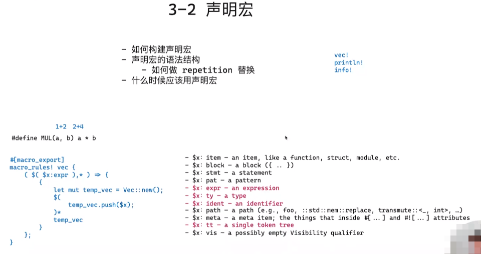
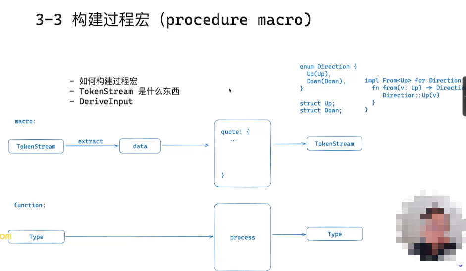

# Geektime Rust 语言训练营

## 第三周: 透视之眼: 深入浅出元编程

## 常用的宏编程包

```toml
[package]
name = "macros"
version = "0.1.0"
edition = "2021"
license = "MIT"

[lib]
proc-macro = true

[dev-dependencies]
anyhow = "1.0.95"
futures = { version = "0.3.31", default-features = false }
tokio = { version = "1.43.0", features = ["rt", "rt-multi-thread", "macros"] }

[dependencies]
darling = "0.20.10"
proc-macro2 = "1.0.92"
quote = "1.0.38"
syn = { version = "2.0.95", features = ["extra-traits"] }
```






```bash
$ cargo install cargo-expand
$ cargo expand --example enum_macro
```


> 方便操作创建宏的工具: darling包


